<p align="center">    
<strong>Kage CSS (影 = Shadow) — Custom Glassmorphism CSS</strong>
<p>

A polished, animated glassmorphism theme for the Kagi search engine. Clean UI, subtle motion, consistent styling across results, images, videos, news, and podcasts.

## Gallery (Static Images)

- Start page
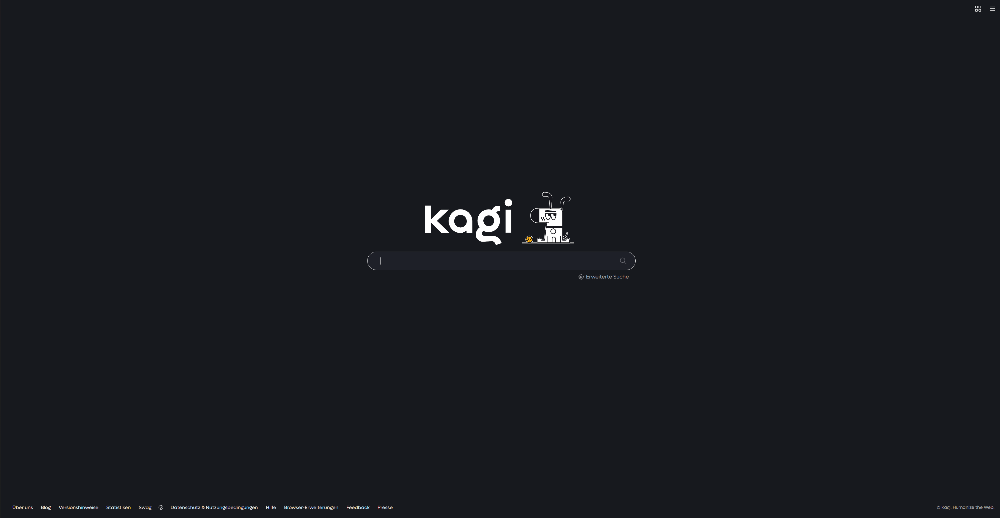

- Search results
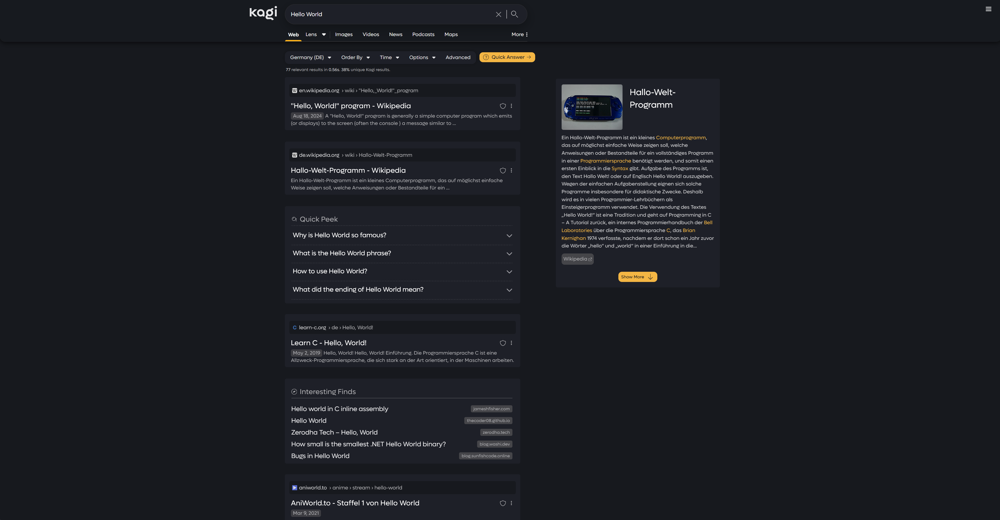

- Searchbar
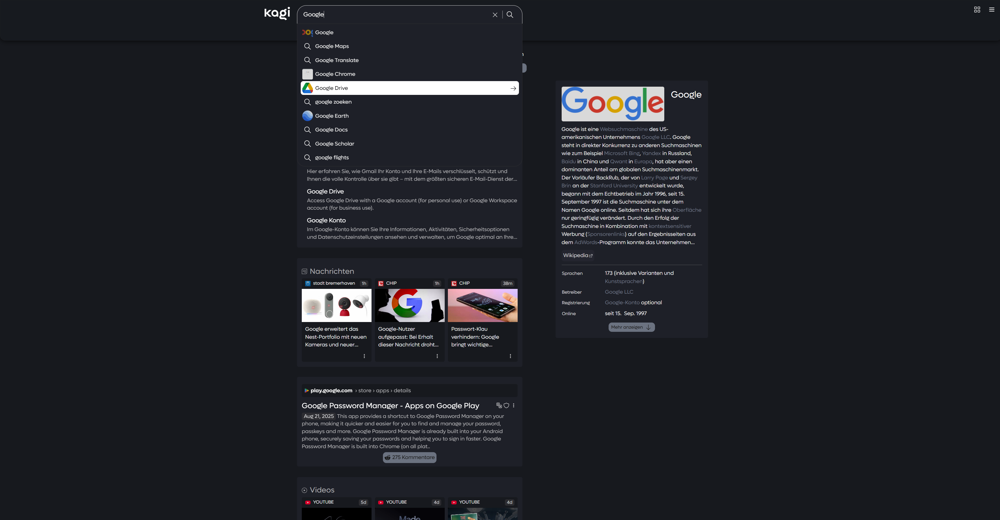

- Quick Answer
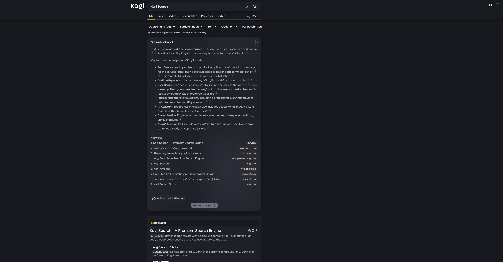

- Domain info
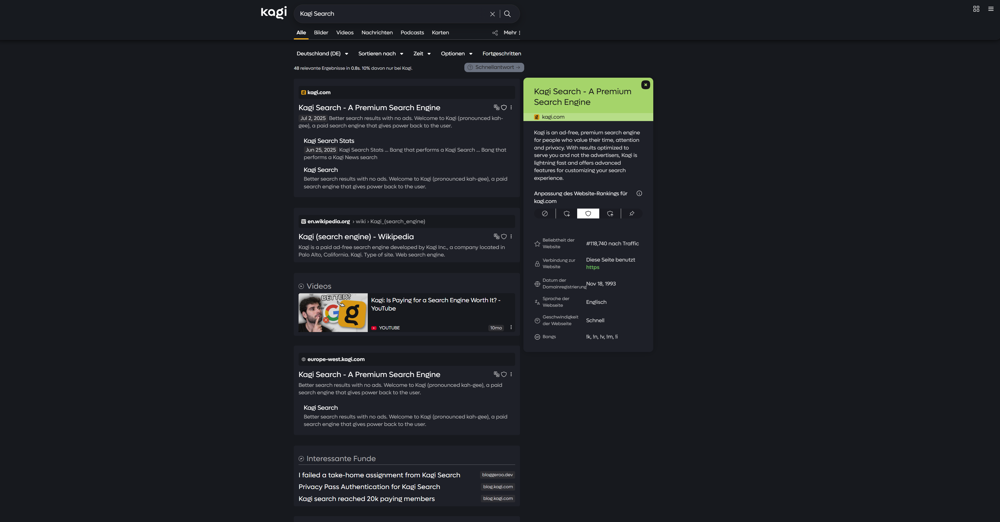

- Dropdowns
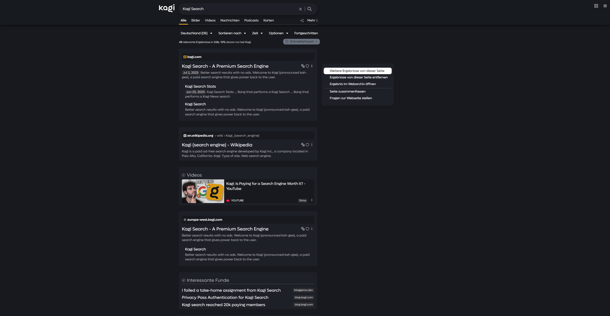

- Glassy Dropdown
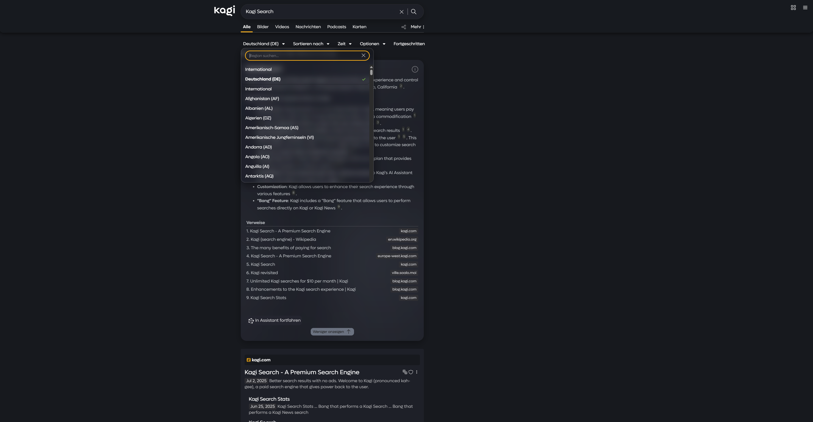

- Assistant
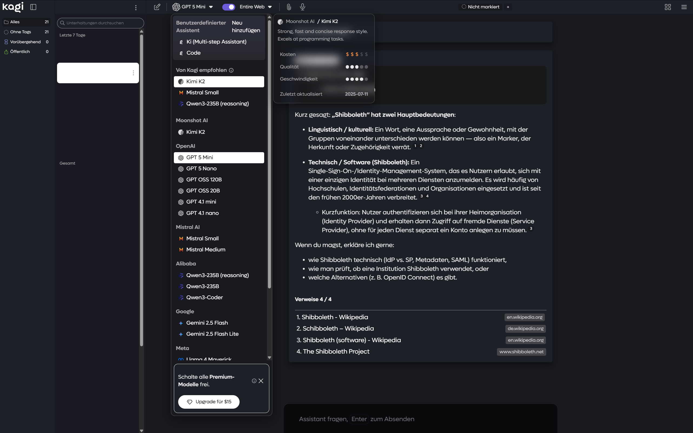

- Assistant Prompt Box
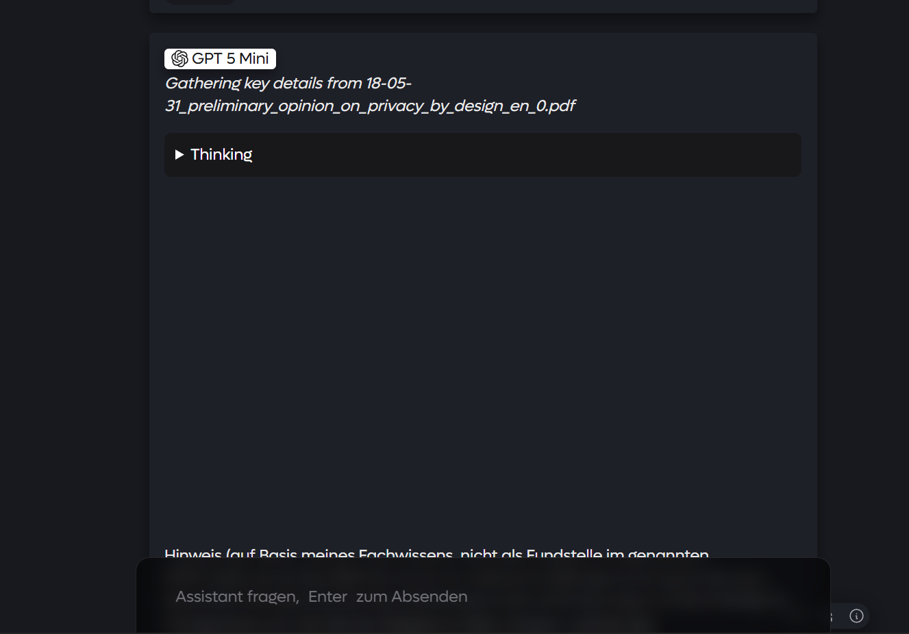

- News Tab
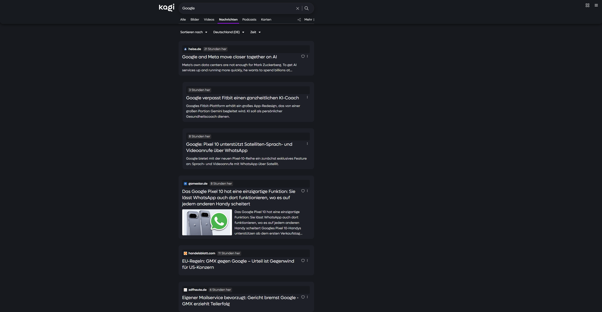

- Podcasts Tab
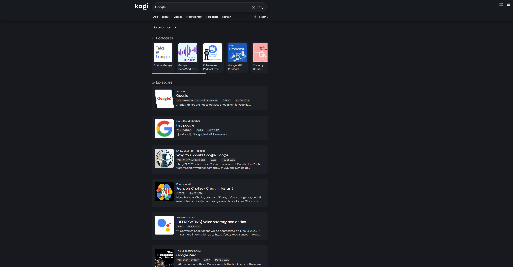

## Overview

kagi-css is a custom stylesheet that gives Kagi a refined glassmorphism look with smooth transitions and a cohesive UI.

## Features

- Glassmorphism visuals for navigation, settings, and key UI elements
- Thoughtful documentation and structure for easy customization
- Smooth animations and hover effects
- Enhanced buttons, search bar, and results layout
- Responsive across desktop and mobile
- Easy color customization via variables at the top of the file
- Uniform styling for results, images, videos, news, and podcasts

## Installation

1) Download custom.css from this repository.
2) In Kagi, enable custom CSS: https://kagi.com/settings?p=custom_css
3) Paste the entire CSS into the input field.
4) Save and refresh Kagi.

Recommended setting: Set URL placement to “Above Title” under Appearance for best visual alignment. (With the latest update, the theme can now be used without the following setting.)


> [!IMPORTANT]
> The theme only works correctly if you set it to dark mode.

If you encounter problems with glass morphing in Firefox, this is not a problem and does not prevent you from using this theme. Simply comment out the following code.

```css
/* If Firefox has problems with the blur effect, comment out this code. <--- delete this line
@-moz-document url-prefix() {
  .backdrop-blur-elements {
    backdrop-filter: none !important;
    -webkit-backdrop-filter: none !important;
    background: rgba(30, 32, 40, 0.95) !important;
  }
} delete this ---> */ 
```

## Customization

Feel free to customize the theme's colors as you wish. To do this, you can adjust the variables at the beginning of the CSS file. Here you will also find a short description for each variable:

```css
--bg-primary: #17191e;                          /* Main page background */
--bg-secondary: #1A1B22;                        /* App background */
--bg-tertiary: #1e2028;                         /* Input fields, secondary areas */
--bg-container: #24252F;                        /* Containers, cards, panels */
--bg-elevated: #2A2B36;                         /* Elevated elements (hover, active) */
--bg-modal: #121213;                            /* Modal background */
--bg-dropdown: #34373f;                         /* Dropdown hover */
--bg-special: #28282a;                          /* Wikipedia results */
--bg-citation: #2d2f2f;                         /* Citation background */
--bg-separator: #222222;                        /* Separators, gaps */

--text-primary: #EAEAEA;                        /* Primary text (light) */
--text-secondary: #A0A0B4;                      /* Secondary text */
--text-muted: #b3b7bb;                          /* Summary text */
--text-citation: #8d9191;                       /* Citation text */
--text-dark: #1b1b1b;                           /* Dark text on light buttons */
--text-very-dark: #232325;                      /* Very dark text */
--text-light: #fdfdfd;                          /* Very light text (tooltips) */

--button-bg: #6B7280;                           /* Default button background */
--button-hover: #9CA3AF;                        /* Button hover background */
--link-visited: #8B89A3;                        /* Visited links */
--link-hover: #9CA3AF;                          /* Link hover color */
--source-highlight-color: #A1A1AA;              /* Source highlight */
--theme-switch-hover: #2a2d38;                  /* Theme switch hover */

--status-good: #a5d46a;                         /* Normal */
--status-mid: #ffdf80;                          /* Warning */
--status-danger: #ffa080;                       /* Danger */
--auto-suggestion: rgba(29, 237, 131, 0.2);     /* Auto-completion */

--timestamp-bg: rgba(49, 49, 53, 0.8);          /* Timestamp background */
--backdrop-fallback: rgba(30, 32, 40, 0.95);    /* Backdrop without blur */
--dropdown-bg: rgba(30, 32, 40, 0.32);          /* Dropdown background */
--border-thread: rgba(255, 255, 255, 0.28);     /* Thread menu border */

--shadow-medium: rgba(0, 0, 0, .2);             /* Light shadow */
--shadow-strong: rgba(0, 0, 0, .4);             /* Medium shadow */
--shadow-dark: rgba(0, 0, 0, .6);               /* Strong shadow */
--shadow-very-dark: rgba(0, 0, 0, .7);          /* Very strong shadow */
```

## Donation

This theme took a great deal of time to get to the level it is at today. I don't expect any payment and did everything purely to support the Kagi Network. If you use one of my themes and would like to support me financially, you are welcome to do so via the button below.

I am very grateful for every donation! If you would like your name to be displayed below as a sponsor, feel free to write to me on Discord or Reddit, and I will add you here as a sponsor.

The theme will continue to be updated, even without a single donation! This is just meant to be an option, not an obligation. A donation does not unlock any additional features or a "special version" of the theme.

<a href="https://buymeacoffee.com/pdanzma" target="_blank"></a>

## Animations

- Results fade-in as they load
- Pleasant hover transitions on links and buttons
- Subtle tile and component motion for a lively feel

## What’s New

### 30. September 2025

**v3.0 Theme adaptation for mobile devices**

With this major new update, many issues regarding the use of the theme on mobile devices have been fixed and general adjustments have been made in many places. Another major point is the revised color variable directory, right at the beginning of the .css file. Here you can now granularly customize the theme according to your wishes and preferences. Here in the Readme, you will also find a short description of the variables. Unfortunately, I have once again hit the 40,000-character limit, which is why the code has been highly compressed and is no longer as visually appealing. I apologize for this, but I couldn't think of another solution. Thanks again to @rogue au for sharing the tool [CSSO](https://css.github.io/csso/csso.html) and to its creator. Additionally, the following bugs have been fixed:

- Hover state is no longer applied on “Kagi Specials” and “Kagi Changelog”
pages (html[data-apth=”/lens”])
- Assistant: Code block color now adapts
- Assistant: Tables now adapt their color
- Assistant: Percentage display now matches the theme
- Assistant: Model view update has been adjusted
- Complete overhaul of the color variables → better customizability
- Fixed a Kagi theme bug that affected the “Kagi Specials” and “Kagi
Changelog” pages.
- Hover boxes, "Advanced Search", dropdown menus for selection, and the timestamp on videos are now semi-transparent and glass-like
- Discord user: "The assistant button looks funky for me on mobile, this is for Kagi.com itself without searching anything"
- Messages (Kite) have been revised

@Zeuhx:
- “The share icon have a different color for the desktop"
- "Small color bug in Kagi Assistant"
- "Theme seems not applied for News sections"
- "A small theme color bug when I switch to a lens search"

@Temanor:
- "Yeah, that one. The favicon just kinda gets pushed to the left."
- "Mine is completely white." -> Ki Icon Bug in Assistant
- "When opening this menu in the top right corner, the icon dissapears, and there is no X to close it either."
- "This dropdown menu is slightly misalligned from the button."
- "I didn't really have any issues with the current method of having the current model have white background [...]"
- "Hover effect for the header on the changelog page"

Thank you for using the theme!


## Roadmap

### Near-term
- [ ] Reduce the performance impact
- [ ] Optional compact density mode (tighter paddings and gaps)
- [ ] Fix z-index bugs

### Mid-term

### Omnipresent

- [ ] Always update to the latest changes of Kagi
- [ ] Adapt bug report from discord thread

## Tips & Notes

- Not affiliated with Kagi. This is a community theme.

## Contributing

Issues and ideas are welcome. If you spot a bug or have suggestions, reach out on Discord in kagi-discussions → “UI Design Ideas for my custom css”.

Discord thread: https://discord.com/channels/1256077108111868035/1265596713083732060

## Credits

Created by pdanzma. Inspired by modern search UIs (e.g., Google and Brave) with many original touches.

## License

See LICENSE file for terms. Feel free to fork this project and change it to your needs :)
