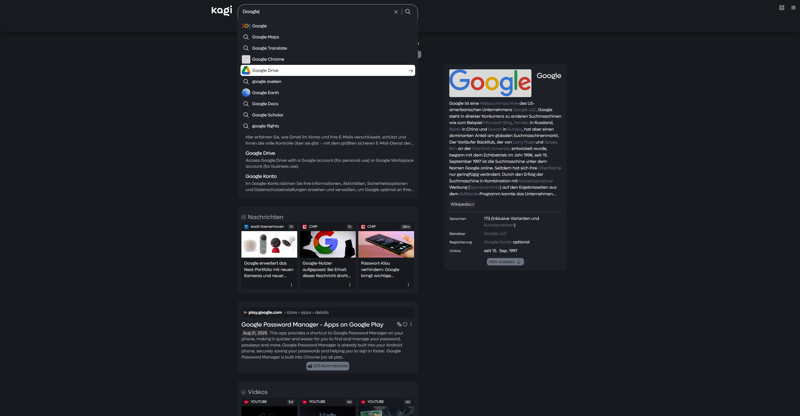
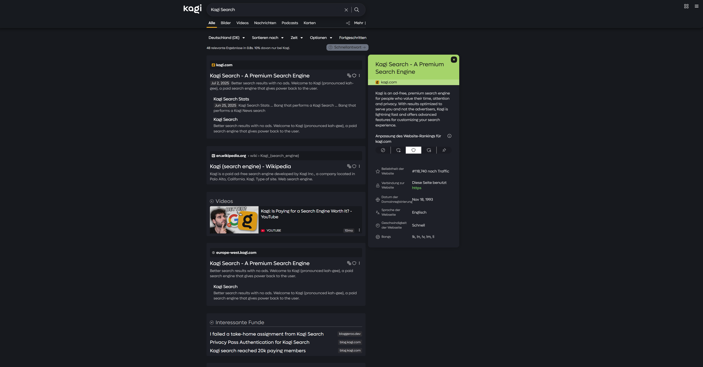
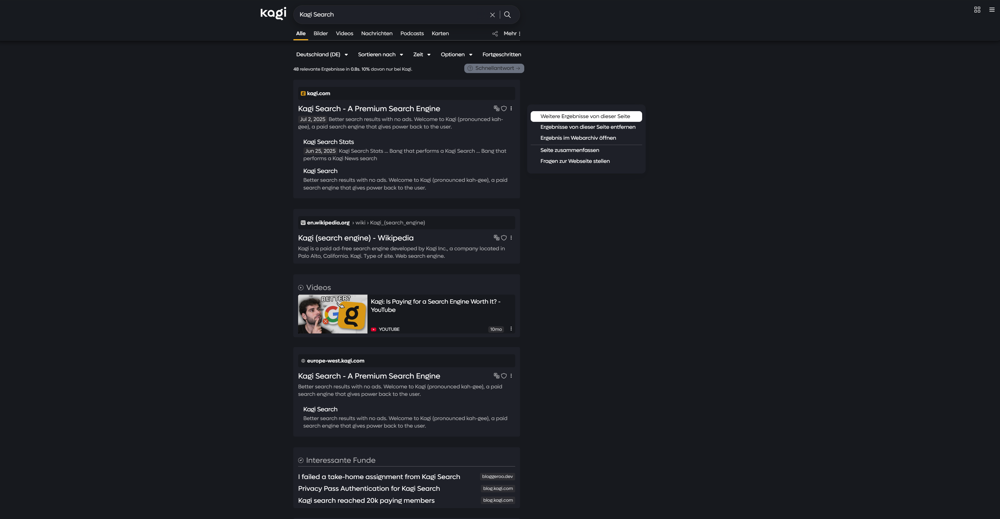
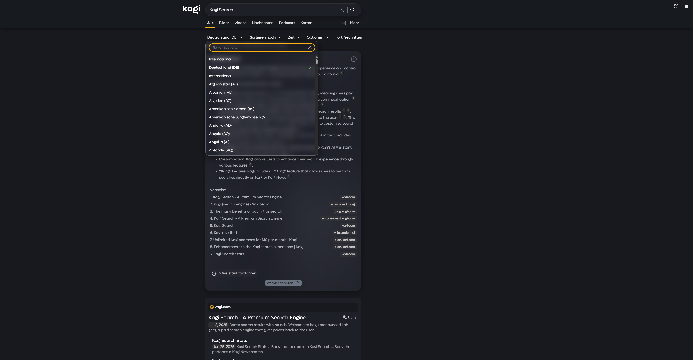
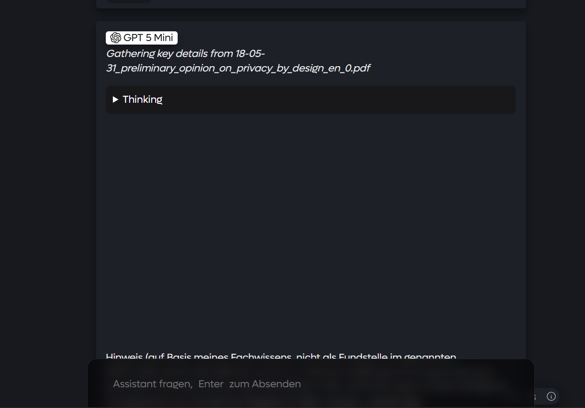
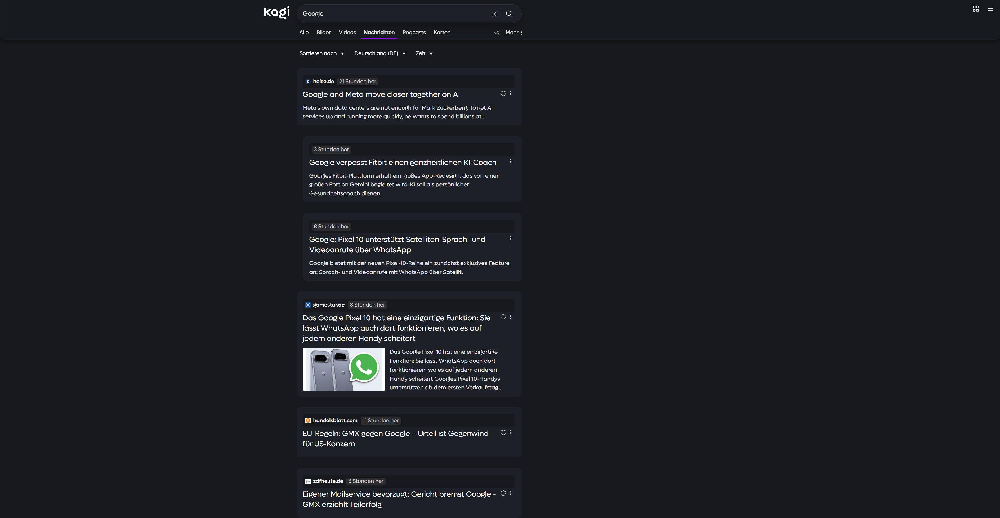

<p align="center">    
<strong>Kage CSS (影 = Shadow) — Custom Glassmorphism CSS</strong>
<p>

A polished, animated glassmorphism theme for the Kagi search engine. Clean UI, subtle motion, consistent styling across results, images, videos, news, and podcasts.

## Gallery (Static Images)

- Start page


- Search results


- Searchbar


- Quick Answer


- Domain info


- Dropdowns


- Glassy Dropdown


- Assistant


- Assistant Prompt Box


- News Tab


- Podcasts Tab


## Overview

kagi-css is a custom stylesheet that gives Kagi a refined glassmorphism look with smooth transitions and a cohesive UI.

## Features

- Glassmorphism visuals for navigation, settings, and key UI elements
- Thoughtful documentation and structure for easy customization
- Smooth animations and hover effects
- Enhanced buttons, search bar, and results layout
- Responsive across desktop and mobile
- Easy color customization via variables at the top of the file
- Uniform styling for results, images, videos, news, and podcasts

## Installation

1) Download custom.css from this repository.
2) In Kagi, enable custom CSS: https://kagi.com/settings?p=custom_css
3) Paste the entire CSS into the input field.
4) Save and refresh Kagi.

Recommended setting: Set URL placement to “Above Title” under Appearance for best visual alignment. (With the latest update, the theme can now be used without the following setting.)


> [!IMPORTANT]
> The theme only works correctly if you set it to dark mode.

If you encounter problems with glass morphing in Firefox, this is not a problem and does not prevent you from using this theme. Simply comment out the following code.

```css
/* If Firefox has problems with the blur effect, comment out this code. <--- delete this line
@-moz-document url-prefix() {
  .backdrop-blur-elements {
    backdrop-filter: none !important;
    -webkit-backdrop-filter: none !important;
    background: rgba(30, 32, 40, 0.95) !important;
  }
} delete this ---> */ 
```

## Donation

This theme took a great deal of time to get to the level it is at today. I don't expect any payment and did everything purely to support the Kagi Network. If you use one of my themes and would like to support me financially, you are welcome to do so via the button below.

I am very grateful for every donation! If you would like your name to be displayed below as a sponsor, feel free to write to me on Discord or Reddit, and I will add you here as a sponsor.

The theme will continue to be updated, even without a single donation! This is just meant to be an option, not an obligation. A donation does not unlock any additional features or a "special version" of the theme.

<a href="https://buymeacoffee.com/pdanzma" target="_blank"></a>

## Animations

- Results fade-in as they load
- Pleasant hover transitions on links and buttons
- Subtle tile and component motion for a lively feel

## What’s New

Good news: The character limit for CSS in Kagi has been increased to 40,000, so the old workaround with add-ons is no longer necessary and the all-in-one solution can be used directly. Thank you, Kagi team! 

### 25. August 2025

Massive update that puts nearly all existing elements to the test and fundamentally restructures them. The best new features:
- Automatically disables systemwide animations for users who have enabled “Reduce motion” in their system settings - Increased accessibility.
- Explicit Firefox blur effect generation can now be disabled.
- Background animation now forces GPU acceleration
- Blur effects are now generated by the GPU instead of the CPU → significantly improves performance (GPU acceleration)
- CLS-safe fade-in animation
- Significantly fewer transitions: all […]

If you still experience severe performance drops due to the various glass morphing effects, you can also search for the rules in the CSS and explicitly set them to none. Here's how:
```css
/* Search for the term: */
    backdrop-filter: blur(12px) saturate(120%);
    -webkit-backdrop-filter: blur(12px) saturate(120%);

/* change it to: */
   backdrop-filter: none;
   -webkit-backdrop-filter: none;

/* or completly delete the following lines */
   backdrop-filter: blur(12px) saturate(120%);
   -webkit-backdrop-filter: blur(12px) saturate(120%);
   background: rgba(30, 32, 40, 0.12);
                  ^-- to: rgb   ^----- delete the forth argument
   
/* should look like this after: */
   background: rgb(30, 32, 40);
```

A big thank you to @Temanor on Discord, who sent me lots of bugs with pictures.

## Roadmap

### Near-term
- [ ] Reduce the performance impact
- [ ] Optional compact density mode (tighter paddings and gaps)
- [ ] Fix z-index bugs

### Mid-term
- [ ] Improved mobile layout and touch targets

### Omnipresent

- [ ] Always update to the latest changes of Kagi
- [ ] Adapt bug report from discord thread

## Tips & Notes

- Mobile: The theme is responsive, but visual density differs from desktop; adjust variables if desired.
- Not affiliated with Kagi. This is a community theme.

## Contributing

Issues and ideas are welcome. If you spot a bug or have suggestions, reach out on Discord in kagi-discussions → “UI Design Ideas for my custom css”.

Discord thread: https://discord.com/channels/1256077108111868035/1265596713083732060

## Credits

Created by pdanzma. Inspired by modern search UIs (e.g., Google and Brave) with many original touches.

## License

See LICENSE file for terms. Feel free to fork this project and change it to your needs :)
